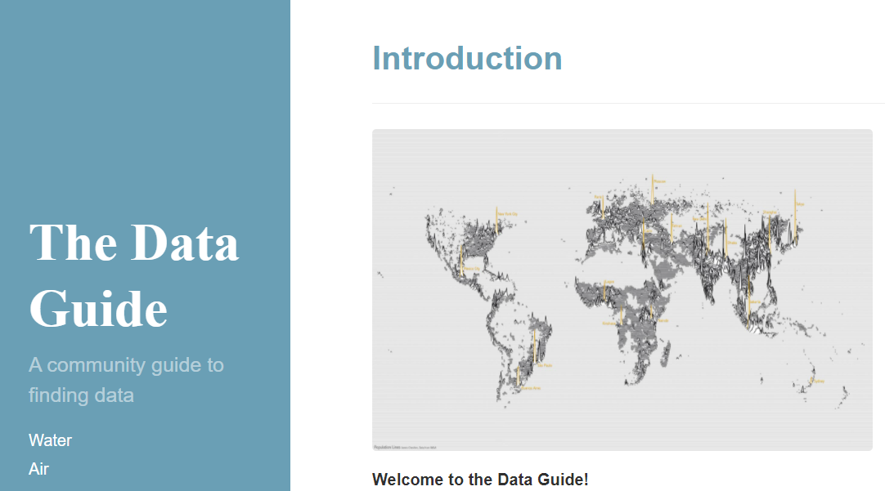
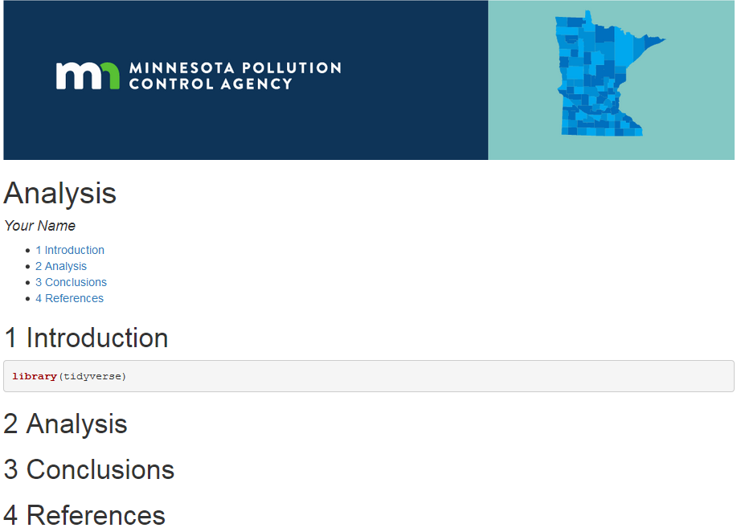

# ` tidy( Tuesdays )`


<br>

Each week features a new data set to explore. Come see examples of how others clean, analyze, and visualize data. Learn new methods and share your own. Bring your burning questions, new packages, funny graphs, puzzles, and everything else you'd like to discuss about environmental data.  

<br>

:rocket: **Explore this week's [[ Data ]](https://github.com/rfordatascience/tidytuesday#datasets) and see what others are [[ Sharing ]](https://twitter.com/hashtag/TidyTuesday)**


<br>


## Schedule - Up Next
 

February:  Making connections that last :heart:

March: Spring cleaning :broom:

April: Data flows and showers :droplet:

May: Work smarter not harder :muscle: :sweat_drops:

June: Work smarter not harder v.2 :muscle: :muscle:                                                                                    

<br>

|      | |  👀 Show-n-tell | :candy: `sugaR pts`  | 
| ---  | --- | --- | --- | 
| May 17 | | Databases *-(Eileen Campbell)* | 2500 `pts` |
| May 24 | | Using RODBC to pull from databases *-(Carl, Kristie, Andrea, Dorian)* | 78 `pts` |
| May 31 | | Regular expressions *-(Kristie, Dorian, Barbara)* | 100 `pts` |
| June 7 | | Web scraping *-(Dorian, Allison)* | 54 `pts` |
| June 14 | | getting data from PDFs *-(Derek, Barbara)* | 68 `pts` |
| June 21 | | make requests of websites to get data *-(USGS packages)* | 900 `pts` |
| June 28 | | youtube on OCR optical character recognition and audio transcription *-(everyone) | 10000 `pts` |
<br>

<details>
<summary> <b> See older topics </b></summary>
  
| Date | R demo <br> _training_  | Show-n-tell <br> **:tada:** <br> _2nd half_ | :candy:`sugaR pts`   |   
| ---  | --- | --- | --- | 
| May 10 | | scheduled tasks *-(Barbara, Dorian)* |123 `pts`|
| May 3 | | purrr functions recap *-(Kristie, Dorian, Barbara, Derek, Carl)* | 23 `pts`|
| Apr 26 | | Nila Hines MPCA Data Governance - Program Manager *-(all)* | 53000 `pts`|
| Apr 5 | | Rainier The Data Dictionary An Intro *-(Barbara, Carl in absentia)* | 3200 `pts`|
| Apr 12 | | meet the new Data Governance Coordinator! *-(Nila Hines)* | 520 `pts`|
| Apr 19 | | connecting to WISKI *-(Andrea)* | all the `pts`|
 | Mar 1 | | findR() & the R Studio way & set goals & begin clean up *-(Kristie)* | 32 `pts`|
| Mar 8 | | working in projects and file structures & common code conventions *-(Barbara, Dorian)* | 520 `pts`|
| Mar 15 | | clean up with help available, focus: deprecated functions *-(all)* | all the `pts`|
| Mar 22 | | clean up with help available, focus: cleaning up workflows in R *-(Anne Claflin)* | 53000 `pts`|
| Mar 29 | | clean up with help available, focus: getting rid of for loops with purrr*-(all)* | all the `pts`|
| Feb 01 | | Month of connections, correlations, and joining ❤️  *-(Kristie, Barbara, Dorian)* | 100 `pts` |
| Feb 08 | | Joins  *-(Kristie, Barbara, Dorian)* | 100 `pts` |
| Feb 15 | | purrrrrr package and map functions  *-(Derek)* | 2300 `pts` |
| Jan 25 | | Top tips and tricks used in 2021   *-(Kristie, Barbara, Dorian)* | 100000 `pts` |
| Jan 18 | | Top ~~5~~ ~~10~~ 15 errors  *(Kristie)* | 98 `pts` |
| Jan 11 | | [Top 5 packages used in 2021](https://github.com/MPCA-data/tidytuesdays/blob/main/show-n-tell/anniversary/2021_Best_of_Pkgs.md) *(Dorian)* | 12200 `pts` |
| Jan 04 | | Top 10 functions used in 2021 *(Barbara)* | 32 `pts` |
| Dec 28 | No meeting. | ~~Celebrating ❄️ and 🍪s and new pajamas  *-(the group)*~~ | 20 `pts` | 
| Dec 21 | | tidycensus and snow stuff and hitting apis *-(Barbara and Kristie)* | 1000 `pts` |
| Dec 14 | | Check in on packages *-(the group)* | 1220 `pts` |
| Dec 7 | :evergreen_tree::snowman: | Make a package / gift for others 📦🎁  *(the group)* | 1220 `pts` |
| Nov 30 |  | Share your workbook on Github  *(the group)* | 1220 `pts` |
| Nov 23 | Holiday time! *(Thanksgiving turkeys)* | <strike>Cancelled. Eat potatoes/turnips, work on your project </strike> | 124 `pts` |
| Nov 16 | Start w/ Github :octocat: | Review `openxlsx` - Check in with questions on workbook *(Kristie & Dorian & Barbara)* | 22 `pts` |
| Nov 9 | [complete()](https://github.com/MPCA-data/tidytuesdays/blob/main/show-n-tell/tidyr/) the data *(Dorian)*  | Check in with questions on workbook and review `read_excel()`  *(Dorian & Barbara)* | 122 `pts` |
| Nov 2 |   | Make **Excel**  from R - Format pretty workbooks *(Barbara)* | 1022 `pts` |
| Oct 26 | 🐙💰 R games: **[1. Rock-Paper-Scissors](https://github.com/MPCA-data/tidytuesdays/blob/main/show-n-tell/exercises/rock-paper-scissors.md)**| 👻 Scary functions and `exists(ghosts)` *(Kristie)* | 3500 `pts` |
| Oct 19 |  | [fill(), complete(), and nesting](https://github.com/MPCA-data/tidytuesdays/blob/main/show-n-tell/tidyr/)  *-(Dorian)* | 10 `pts` |
| Oct 12 | | the new dplyr getting away from mutate_at() & mutate_all() (Kristie) | 24 `pts` |
| Oct 05 | | pivot_wider and pivot_longer (Barbara) | 200 `pts` |
| Sep 28 | | Shiny tool from UMN School of Public Health grad students | 2500 `pts` |
| Sep 21 | | :recycle: Barbara's trashy leaflet adventures | 3500 `pts` |
| Sep 14 | [USGS examples](https://labs.waterdata.usgs.gov/visualizations/temperature-prediction/index.html#/modeling) | `sf` package review and updates (Kristie) | 3500 `pts` |
| Sep 07 | | Spatial analysis of met data (Nick Witcraft) | 4500 `pts` |
| Aug 31 | | Show-n-tell real world stats (Everyone) | 2500 `pts` |
| Aug 17 | | Common mistakes and pitfalls in stats | 1000 `pts` | 
| Aug 24 | | Basic probability in swirl() all | 5000 `pts` |
| Aug 10 | | Less basic stats 2 in R (Nick W & David Brown & Barbara Monaco) | 100 `pts` |
| Aug 03 | |  Basic stats 1 in R (AMA with Barbara Monaco) | 30 `pts` |
| Jul 27 | A Shiny example (Marta) | Database panel discussion | 10000 `pts` |
| Jul 20 | [Hands-on DIY Database and queries with Access](https://mpca-data.github.io/Data-Guide//98-helpful_tools/)  | | 10000 `pts` |
| Jul 13 | Database July |  Accessing legacy or external databases RODBC ORACLE MS ACCESS  | 445 `pts` |
| Jul 06 | |  Writing and reading data into a database SQLite with Barbara | 250 `pts` |
| Jun 29 | |  Monte Carlo simulation with Max K | 10000 `pts` |
| Jun 22|  PDF data | Calendar plots and times series -Barbara | 215 `pts` |
| Jun 08 | |  Animated maps - Pirate treasure wrap-up | 326 `pts` |
| Jun 01 | Exceling w/ `ggplot` -Kristie | Celebrating DEREK! 🥳  | 36 `pts` |
| May 25 | Data questions & Messy Barbara data |  Exceling w/ `ggplot` -Kristie | 36 `pts` |
| May 18 | |    Drag and drop Tableau style with the `esquisse` Extravaganza -Derek | 326 `pts` |
| May 11 | [`leaflet` Lollapalloza on the High Seas](https://github.com/MPCA-data/tidytuesdays/blob/main/show-n-tell/maps/leaflet_intro.Md#maps-are-fun-again) *-Dorian* |  [Hidden treasure](https://github.com/MPCA-data/tidytuesdays/blob/main/show-n-tell/maps/leaflet_intro.Md#where-be-yarr-treasure)   | 36 `pts` |
| May the 4th | |  Begin the month of Plots! - `plotly` Party -Barbara | 34 `pts` |
| Apr 27 | |  Tidy Tuesday planning & `sqlite` databases in R -Barbara  | 14 `pts` |  
| Apr 21 | A `%>%` is a pipe. [Pipes, pipelines](https://mpca-air.github.io/RTrain4/03_Day3.html#5), dots and *magrittr* operators |  What's the point? The dot (`.`) does a lot.   | 78 `pts` |  
| Apr 13 | [dplyr:: dates, filter, mutate review](https://mpca-air.github.io/RTrain4/03_Day3.html#5) | 🕵️‍♀️ [Cat Detectives](https://github.com/MPCA-data/tidytuesdays/tree/main/show-n-tell/exercises/missing_cats) :cake:  | 14 `pts` |
| Apr 06 | [lubridate:: Working with Dates](https://mpca-air.github.io/RTrain4/03_Day3.html) | [My 1st R Markdown document](https://github.com/MPCA-data/tidytuesdays/blob/main/show-n-tell/Rmarkdown/my_1st_markdown.MD) | 14 `pts` |
| Mar 30 | [dplyr:: Data mutating](https://mpca-air.github.io/RTrain4/02_Day2.html)  | Searching for emails -Derek   | 100 `pts` |
| Mar 23 | [dplyr:: filter() data](https://mpca-air.github.io/RTrain4/02_Day2.html) | Group - All hands on deck filter time -Dorian  | 0 `pts` |
| Mar 16 |  | Intro to tidymodels and machine learning -Derek  | 58 `pts` |
| Mar 9 | [dplyr:: select & arrange](https://mpca-air.github.io/RTrain4/02_Day2.html) | Messy data contest - Barbara wins :trophy: | 58 `pts` |
| Mar 2 | [More dplyr :: select & arrange](https://mpca-air.github.io/RTrain4/02_Day2.html) | [Finding Carmen Sandiego!](https://github.com/MPCA-data/tidytuesdays/blob/main/show-n-tell/sf_carmensandiego/get_the_data.R) the `sf` package: distances, buffers and intersections - Kristie | 48 `pts` |
| Feb 23 | [Intro to dplyr :: Data exploration](https://mpca-air.github.io/RTrain4/02_Day2.html) | Keeping tables and figures organized in R notebooks. --Bruce M. | 28 `pts` |
| Feb 16 | [ggplot2 & Charts](https://mpca-air.github.io/RTrain4/01-Day1.html) | R Tips and Tricks/Best Practices -- | 38 `pts` |
| Feb 9 | [Read data & CSVs](https://mpca-air.github.io/RTrain4/01-Day1.html#3_read_data) | [Stage 1: Wampas](https://github.com/MPCA-data/tidytuesdays/blob/main/show-n-tell/R2D2_missions/stage_1.MD#stage-1---a-wampa-rumpus) | [R2D2 - R training tracker](https://mpca-data.github.io/R2D2_rescue_mission/) |  68 `pts` |
| Feb 2 | [RStudio: Project setup](https://mpca-air.github.io/RTrain4/01-Day1.html#why_r) | [Stage 0: Start Here](https://github.com/MPCA-data/tidytuesdays/blob/main/show-n-tell/R2D2_tracker/stage_0.MD#start-here) | Bootstrapping :boot: your 95% confidence intervals - Derek|  8 `pts` |
| Jan 26 | :tada::tada::balloon: 1-Year ANNIVERSARY! Group Celebration time :cake::tada::tada:   |  | 444 `pts` |
| Jan 19 | 1-yr Celebration plan & Publication ready Tables - Barbara |  | 244 `pts` |
| Jan 12 |  [ggplot review](https://github.com/MPCA-data/tidytuesdays/blob/main/show-n-tell/exercises/Stars_and_galaxy_plot.MD) - Plotting with stars and [_patchwork_](https://patchwork.data-imaginist.com/) - Dorian | | 244 `pts` |
| Jan 05 | R Resolutions: Learning goals for 2021 - Kristie & [Send E-mails with R](https://github.com/MPCA-data/tidytuesdays/blob/main/show-n-tell/emails/R%20send%20email.R) - Derek |  | 144 `pts` |  
| Dec 15 | [Survey Analysis w/ MPCA's Travel survery](https://github.com/MPCA-data/tidytuesdays/blob/main/show-n-tell/survey_data/commuter_survey_analysis.R) - Laura & Derek | -- | 650 `pts` |
| Dec 08 | :art::earth_africa: [Group Exercise: ARTsy Maps](https://github.com/MPCA-data/tidytuesdays/blob/main/show-n-tell/maps/art_map_poster.md#map-art) - Dorian  | -- | 14 `pts` |
| Dec 01 | Fabulous day of errors, mistakes, and Gotcha's - Kristie | -- | 42 `pts` |
| Nov 17 | [More Dates & Times - A Loon Survery](https://github.com/MPCA-data/tidytuesdays/blob/main/show-n-tell/dates/Loon_survey_DATES_exercise.md#loon-survey-2021) | [Dates](https://forms.gle/YutRu6RfnVGJRo3y9) _(quizzlet)_  | 1.1 `pts` |
| Nov 10 | Day of Dates and Timezones - Dorian | [Dates](https://forms.gle/YutRu6RfnVGJRo3y9)  | 1.1 `pts` |
| Nov 3 | [Regular expressions `regex` 101](https://github.com/MPCA-data/tidytuesdays/blob/main/show-n-tell/strings/stringr_regex_tutorial.md) - Derek | [Strings & things](https://forms.gle/bDVjCnwwcQZQB92H8)  | +novemdecillion `pts` |
| Oct 27 | :ghost: [Halloween exercise](https://github.com/MPCA-data/tidytuesdays/blob/main/show-n-tell/exercises/Hallows_Eve.MD#2020--trick-or-treat): Text mining candy / scary movie data  | Everyone | +1031 `pts`|  
| Oct 20 | Time series forecasting :chart_with_downwards_trend:  | Barbara | +2050 `pts`|
| Oct 13 | Group exercise: TidyTuesday data dive [Warmup with Porgs](https://itep-r.netlify.app/page/day2_am.html#porg-review).  Data at `read_csv("https://itep-r.netlify.com/data/porg_data.csv")`  | Everyone | +1000 `pts`|
| Oct 6 | Questions and Andrea's Shiny tool | Andrea | +2000 `pts` |   
| Sep 29 |  [Group exercise fun: Data Validation](https://github.com/MPCA-data/tidytuesdays/tree/main/show-n-tell/tiny_giraffes_data_validation) | Kristie | 1024 `pts`|
| Sep 22 | [USGS R community](https://owi.usgs.gov/R/) & packages** (Emily B. and Aida and Dorian) | | +2000 `pts`|
| Sep 15| Group [`swirl`](https://github.com/swirldev/swirl_courses#install-and-run-a-course-automatically-from-swirl) `Back to Basics` :: [Quick Start](https://github.com/MPCA-data/tidytuesdays/blob/main/show-n-tell/exercises/swirl.MD#swirl-setup) | Barbara | +300 `pts`|
| Sep 08 | Q: How to join by date range or fuzzy join or non-equal join? A: Use [`unnest()`](https://github.com/MPCA-data/tidytuesdays/blob/main/help/puzzles/join_range_of_dates.R) or [`library(data.table)`](https://github.com/MPCA-data/tidytuesdays/blob/main/help/puzzles/non_equal_join_example.R)  |  | +55 `pts` |
| Sep 01 | Landuse analysis w/ the raster package (Kristie) | | +140 `pts` |  
| Aug 25 | Finish for() loops, and apply() functions | | +120 `pts` |
| Aug 18 | for() loop alternatives: apply() functions & looping w/ purrr (Derek)| | +1500 `pts` |
| Aug 11 | Non-parametric stats with water Sulfate data | | +1000 `pts`|
| Aug 04 |  R Markdown [`mpcareports`](https://github.com/MPCA-data/mpcareports/blob/main/README.md#mpcareports) templates & easier databases: [`mpcadb`](https://github.com/MPCA-data/mpcadb#mpcadb) (Dorian)** | | +50 `pts`|
| Jul 28 |  (Barbara improvises) | |  +200 `pts` * |
| Jul 21 | [Get data from TEMPO or OnBase and score the similarity of names](https://github.com/MPCA-data/tidytuesdays/blob/main/show-n-tell/strings/tidytuesday_stringdist.R): [`stringdist()`](https://github.com/markvanderloo/stringdist)  (Derek)  | | +1264 `pts`|
| Jul 14 | Introduction to Biological Monitoring program (Joel C) | Bugs! :beetle: Generalized Linear Models (Carl S)| +300 `pts` | 
| Jun 23 | [Checking for differences](https://github.com/MPCA-data/tidytuesdays/blob/main/show-n-tell/reading_files/Waldo_Compare_files_Find_differences.Md) w/ the `waldo` pkg: [`compare()`](https://github.com/r-lib/waldo#installation) _(Dorian)_| [Pear programming puzzles](https://github.com/MPCA-data/tidytuesdays/blob/main/show-n-tell/exercises/pair_programming.md) _(everyone)_ |  +100 `pts` |  
| Jun 16 | [MDH shares: Grouping data frames in a list & date intervals](https://github.com/MPCA-data/tidytuesdays/blob/main/help/insurance_data/function_list_to_df.md) _(Jennifer)_ | Mapping HUGE Raster layers _(Min)_ |  +100 `pts` |   
| Jun 09 | Barbara connects to GIS Rest API services - You can too! | |  +100 `pts` | 
| Jun 02 | Zipping, factors, date joins and more Kristie tips _(Kristie)_ |  |   | 
| May 26 | T-tests and the `carr` pkg; Nonparametric or parametric? _(Barbara)_ |  |   | 
| May 19 | [More mapping tools in R: With MPCA's Environmental Justice maps](https://github.com/MPCA-data/tidytuesdays/blob/main/show-n-tell/maps/find_hospitals.R) _(Dorian)_| |   | 
| May 12 | Shiny tools & [widgets](https://shiny.rstudio.com/gallery/widget-gallery.html) _(Barbara_ & _Derek)_; Schedule your R scripts: Daily, Weekly, Monthly _(Barbara)_ | Use [`fill()`](https://tidyr.tidyverse.org/reference/fill.html) to fill gaps in names w/ previous value _(Kristie)_ |  +100 `pts` | 
| May 05 | Custom colors and palettes _(Barbara)_ | Allison on sulfate outliers  |   +100 `pts` | 
| Apr 28 | [Create a package :package:](https://github.com/MPCA-data/tidytuesdays/tree/main/show-n-tell/make_package#package-take-home-your-very-own-package) _(Dorian)_ | +You? Me? Everyone? |   +100 `pts` |   
| Apr 21 | [Princ. Comp. Analysis and multi-variate predictions](https://github.com/MPCA-data/tidytuesdays/tree/main/show-n-tell/multivariate) _(Kristie)_ | Matt on toxic algae |   +100 `pts` | 
| Apr 14 | [Get 100's of PDFs from TEMPO and read their messy data into R](https://github.com/MPCA-data/tidytuesdays/blob/main/show-n-tell/tempo/Tidy%20Tuesday%20Tempo%20Demo.R) _(Derek)_ |  |   +50 `pts` |  
|  | :earth_asia: [Create & read shapefiles](https://github.com/MPCA-data/tidytuesdays/tree/main/show-n-tell/make_book) _(Kristie)_ |  |   |  
|  | :book: [Make website books w/ Rmarkdown: `bookdown`](https://github.com/MPCA-data/tidytuesdays/tree/main/show-n-tell/make_book) _(Dorian)_ |  |   |  
|  | [Summaries of Non-detect data: `EnvStats` & `NADA`](https://github.com/MPCA-data/tidytuesdays/tree/main/show-n-tell/non-detects) _(Derek + Barbara)_ |  |  |  
|  | [Build your own package: `devtools`](https://github.com/MPCA-data/tidytuesdays/tree/main/show-n-tell/make_package#package-take-home-your-very-own-package) _(Dorian)_ |  |   |  
|  | [Multivariate Analysis](https://github.com/MPCA-data/tidytuesdays/blob/main/show-n-tell/multivariate/multivariate.md) _(Kristie)_ |  |   |  
|  | Microsoft Access data. Arrrrgghh... _(Barbara)_ | |   |   
|  | Time series forecasting, with total garbage data _(Barbara)_ |  |  |  

</details>
<br>


<br>

### Featured functions
| (hex) |  Package | Functions |  What it does | Website |   
| ---  | --- | --- | --- | --- | 
|    | **esquisse** | `esquisser()` | Drag-n drop-ggplots like Tableau | [Get started `esquisse`](https://cran.r-project.org/web/packages/esquisse/vignettes/get-started.html) |  
|    | **dplyr** |  `select()`, `arrange()`, `filter()`, `mutate()`, `summarize()`, `group_by()` | Toolbox for exploring, re-arranging, and summarizing data | [Intro to `dplyr`](https://cran.r-project.org/web/packages/dplyr/vignettes/dplyr.html) |  
|    | **lubridate** | `today()`,`mdy()`, `wday()`, `tz()` | Convert text columns to date objects, extract parts of dates and time such as month, hour, week day. | [Dates & times](https://r4ds.had.co.nz/dates-and-times.html) |
|  | **tidyr** | ['pivot_wider'](https://cmdlinetips.com/2020/11/reshape-tidy-data-to-wide-data-with-pivot_wider-from-tidyr/) and ['pivot_longer'](https://cmdlinetips.com/2020/11/reshape-wide-data-to-tidy-data-with-pivot_longer-tidyr/)| Make your data do WHAT YOU WANT IT TO | [Overview of tidyr](https://tidyr.tidyverse.org/)

<br>

<details>
<summary> <b> See more </b></summary>

| (hex) |  Package    | Function |  What it does | Website |  
| ---  | --- | --- | --- | --- | 
|    | **magrittr** |  `%>%`, `(.)` | Make code readable from left to right | [`%>%` Overview](https://magrittr.tidyverse.org/index.html) |  
|  | **FCUK** | `library(FCUK)` | Suggests typo corrections when code doesn't run. | [Examples & setup](https://github.com/ThinkR-open/fcuk) |
|  | **fitdistrplus** | `denscomp()`, `qqcomp()`, `cdfcomp()`, `ppcomp()` | Provide plots for comparing the fit of various continuous distributions. | [Vignette](https://cran.r-project.org/web/packages/fitdistrplus/vignettes/paper2JSS.pdf) |
  


</details>


<br><br>


## Upcoming Events 🌏

| Date | Time | Event  | Event link | Group webpage |  
| ---  | --- | --- | --- | --- |
| Feb 24, 2022 | 7pm CST | Data Mishaps Night | https://datamishapsnight.com/ | https://www.littlemissdata.com/ |
| June 20-23, 2022 | Virtual Hybrid Conference | useR! 2022 - Nashville TN | https://user2022.r-project.org/ |  |

<br>

## Recordings

| Year | Event  | Topic | Event link | Group webpage |  
| ---  | --- | --- | --- | --- |
| 2021 | Workshop | Rmarkdown: Tips & Tricks w/ the amazing Allison Horst | [Google Drive recording](https://drive.google.com/file/d/1s2eRC8ENiaDFo_6h_W7NwE_kx2xxZLE-/view) | [R-Ladies global](https://rladies.org/) |
| 2021 | Live demo | First steps: Exploring deforestation data (TidyTuesday) w/ Mr. Robinson | [Screencast](https://www.youtube.com/watch?v=0q-qmNkhWyY)| [Past weeks](https://www.youtube.com/playlist?list=PL19ev-r1GBwkuyiwnxoHTRC8TTqP8OEi8) |
| 2021 | Presentation | ggplot: Take a Sad Plot & Make it Better w/ Alison Hill | [Take a Sad Plot & Make it Better](https://www.youtube.com/watch?v=JeRRSGWODBQ)| [R-Ladies global](https://www.youtube.com/channel/UCDgj5-mFohWZ5irWSFMFcng) |
| 2021 | Presentation | aRt + ggplot: exploring radial visualizations + `coord_polar()` | [aRt + ggplot w/ Ijeamaka Anyene](https://www.youtube.com/watch?v=h0i6KAahLY8)| [R-Ladies global](https://www.youtube.com/channel/UCDgj5-mFohWZ5irWSFMFcng) |
| 2021 | Live talks | RStudio:: global conference | [RStudio::global 2021](https://rstudio.com/resources/rstudioglobal-2021/)|  |
| 2020| Conference | useR! 2020: Intl. R user conference | [useR 2020](https://user2020.r-project.org/program/agenda/)|  |

<details>
<summary> <b> See more </b></summary>
 
| Year | Event  | Topic | Event link | Group webpage |  
| ---  | --- | --- | --- | --- |
 | July 5-9th, 2021 | Live Virtual Conference | useR! 2021 | https://user2021.r-project.org/ |  |
| 2020 | Workshop | Intro to R : MARAMA | [Intro to R](https://register.gotowebinar.com/recording/979473951571635467); [tidyverse](https://register.gotowebinar.com/recording/3300678235076032514); [ggplot](https://register.gotowebinar.com/register/2580834570751859715) |  [MARAMA training](https://marama.org/events/introduction-to-r-training-webinar-2020/) |   
| 2020 | Workshop | Plot anything w/ ggplot - Online workshop | [ggplot workshop](https://www.youtube.com/watch?v=h29g21z0a68&feature=youtu.be) |  | 
| 2020 | Conference |  RStudio Conf 2020 - Recordings available | [RStudio 2020](https://resources.rstudio.com/rstudio-conf-2020)  |   https://resources.rstudio.com   |

</details>

<br>

## :hatching_chick: What we are learning

<a href="https://tinystats.github.io/teacups-giraffes-and-statistics/01_introToR.html"></a>
<br><br>

- [Cute giraffe stats](https://tinystats.github.io/teacups-giraffes-and-statistics/01_introToR.html)
- [Coursera courses](https://www.coursera.org/specializations/jhu-data-science#courses)
- [Intro to modeling & predictions](https://supervised-ml-course.netlify.com/chapter1)
- [Mixed model tutorial](https://ourcodingclub.github.io/tutorials/mixed-models/)
- [lme4 package vignette](https://cran.r-project.org/web/packages/lme4/vignettes/lmer.pdf) 
- Jim Peterson syllabus, data, scripts for [Data management and R for fisheries and wildlife](https://sites.google.com/site/rforfishandwildlifegrads/home/)

<br><br><br>

## :book: Readings

- Hadley's [R 4 Data Science](https://r4ds.had.co.nz/)
- [Introduction to Modern Statistics](https://openintro-ims.netlify.app/data-hello.html)
- Rob Hyndman and George Anthanasopoulos' [Forecasting: Principles and Practice](https://otexts.com/fpp3/)
- Introduction to Empirical Bayes: Examples from [Baseball Statistics](https://drob.gumroad.com/l/empirical-bayes)
- [Introduction to Statistical Learning](https://www.statlearning.com/)
- [Modern Statistics for Modern Biology](https://web.stanford.edu/class/bios221/book/Chap-Generative.html)
- Hadley Wickham's [Mastering Shiny](https://mastering-shiny.org/)
- Helsel's books at [Practical Stats](http://www.practicalstats.com/info2use/books.html)

<br/>


## :earth_africa::busts_in_silhouette: Community projects

> Open to all to contribute – that's you!

<br>

| Project | Details | Team contact |  | Wishlist  |  
| ---  | --- | --- | --- | --- | 
| R training | - [Star Wars training](https://itep-r.netlify.com/)  <br/> - [Workshops](https://mpca-air.github.io/RTrain/#workshops) (Maps, Connecting to databases, messy data)  <br/> - [Cat training](https://mpca-air.github.io/RCamp/) (the original)  | | | |   
| [`library(mpcaej)`](https://github.com/MPCA-data/mpcaej#mpcaej) | Shapefiles with MPCA’s criteria for areas of concern for environmental justice | Dorian | | |
| [`library(mncolors)`](https://github.com/MPCA-data/mncolors#minnesota-color-palettes) | Paint your data with colors from the [MN State Brand style Guide](https://mn.gov/portal/brand/style-guide/colors/), plus a few palettes inspired by local landscapes and wildlife. | Dorian | | |
| [`library(mpcadb)`](https://github.com/MPCA-data/mpcadb) | Easy R connections to MPCA’s databases: DELTA, TEMPO, EQUIS, RAPIDS, ONBASE...  <br/> - Store common reference data | Derek | | |
|[MPCA Data Guide](https://mpca-data.github.io/Data-Guide/) | MPCA guide to find data for water, land, air, and more   | Dorian | | Add data publishing/sharing tips  |
| [`library(mpcareports)`](https://github.com/MPCA-data/mpcareports#mpcareports) | MPCA templates for Markdown reports w/ logo, header, etc.   | Dorian | | | 
| [Analysis Methods Guide](https://mpca-air.github.io/air-methods/) | How we analyze monitoring data in R _(currently air focused)_ | Derek | | | 

<br>


## Future topics

<details>
<summary> <b> See ideas </b></summary>
 
> 1. Automate report updating on an R server?
> 1. Download tables of data from websites _(Sarah)_
> 1. Loops: `purrr` package or `for()` loops or `lapply()`?
> 1. Find data in TEMPO database _(Aida)_
> 1. Combine, clean and read output from environmental models such as AERMOD
> 1. Compare large files submitted by consultants: k-diff or `waldo` package
> 1. Intro to Rmarkdown
>     - Create a manual for training or methods documentation
> 1. Maps and shapefiles
>     - Kriging / Spatial interpolating between map points
> 1. Is it an outlier?
> 1. Conditional probability
> 1. Show-n-tell something you want to replace: An Excel tool, Word/PDF report, Access database, 
> 1. `gganimate` Add movement to your charts, make gifs to share
> 1. Project swap - Will it run?
> 1. Working in GitHub
> 1. `data.table` *(Derek)*
> 1. Write tests for your code / functions - `testthat` pkg
> 1. [R generative art](https://www.data-imaginist.com/art)
>    -   

</details>
<br>


## Discussion

Things to talk about.

<details>
<summary> 1 </summary>
    
> How do we approach reproducibility, collaboration and communication about data?

</details>

<details>
<summary> 2 </summary>

> What would a team workflow using open data science tools look like? How do we get there?

</details>

<details>
<summary> 3 </summary>
    
> How do we store and share our methods and code? Do your analyses have versions?

</details>

### 🐈 Save DEREK! 
```.go
source("https://raw.githubusercontent.com/MPCA-data/tidytuesdays/main/show-n-tell/anniversary/text_adventure.R")
```


`> encourage_cat()`

    Meowwww. Hello R Users! 
      \
       \
        \
            |\___/|
          ==) ^Y^ (==
            \  ^  /
             )=*=(
            /     \
            |     |
           /| | | |\
           \| | |_|/\
      jgs  //_// ___/
               \_)

<br>

<br>

> Track your progress on the **[R2D2 Mission board](https://mpca-data.github.io/R2D2_rescue_mission/)** 
>
> <a href="https://mpca-data.github.io/R2D2_rescue_mission/"></a>
>

<br>
