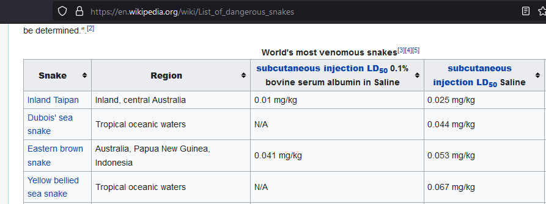
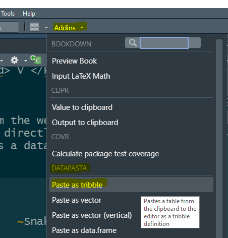
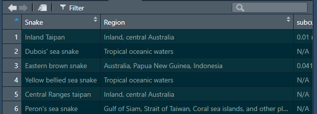
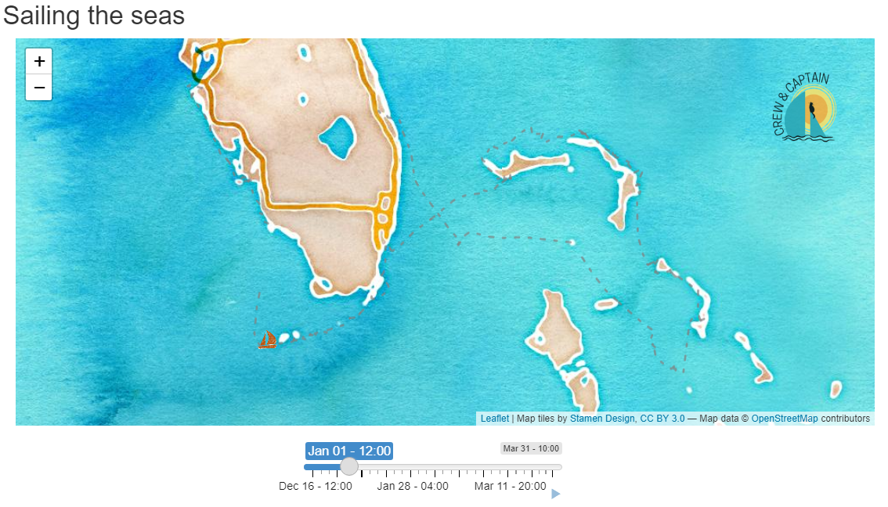

# 📦🎁 2021: *5 packages that keep giving*

<br><br>

## 1. `datapasta`


<br>

This package is a special add-in for RStudio.

Once you install it you gain super powers for copy-pastaing.

- <kbd> CTRL</kbd> + <kbd> C </kbd>
- <kbd> CTRL</kbd> + <kbd> V </kbd>

<br><br>

You can copy a table from the web or Excel, and then paste it directly into your script or console as a data.frame / tibble.

#### 1. Find a table of data you want to copy.

Here's a Wikipedia table of poisonous snakes.



<br>

#### 2. Highlight the column headers and rows you want and COPY: <kbd> CTRL</kbd> + <kbd> C </kbd>

<br>

#### 3. In RStudio, go to `Addins` and select `Paste as tribble`



<br>

#### 4. Voila!



<br>

<br>


## 2. `sf`


<br><br>

This package does 99% of your GIS and Spatial things.

<br><br><br>


#### Create a shapefile 
```r
library(tidyverse)
library(sf)

# Load air sites
sites <- read.csv('https://raw.githubusercontent.com/dKvale/aqi-watch/master/data-raw/locations.csv')

# Create shapefile with 'sf'
sites_shp <- st_as_sf(sites, 
                      coords = c("Long", "Lat"), 
                      crs = 4326, 
                      remove = F)
```

<br>

#### Save to shapefile
```r
st_write(sites_shp, "sites_data.shp")
```

<br>

#### Read a shapefile
```r
sites_shp2 <- st_read("sites_data.shap")
```

<br>

#### View as map
```r
plot(sites_shp2)

# View one column
plot(sites_shp[, 1])
```

<br>

#### Transform coordinates
```r
# Transform to NAD83 UTM Zone 15N
sites_utm <- st_transform(sites_shp, crs = 26915)
```
<br>

### Add new X/Y columns
```r
st_coordinates(sites_utm)

sites_utm <- sites_utm %>%
               mutate(x_utm = st_coordinates(.)[,1],
                      y_utm = st_coordinates(.)[,2])
```

#### Save new coords to .CSV
```r
write_csv(sites_utm, "sites_utm.csv")

# To exclude 'geometry' column from CSV
st_drop_geometry(sites_utm) %>%  
    write_csv("sites_utm.csv")
```

<br>


#### Measure distances
```r
site_distances <- st_distance(sites_utm, 
                              sites_utm)
```

<br>


#### Nearest neighbor
```r
site_neighbor <- st_nearest_feature(sites_utm)
```

<br>
<br>

## 3. `leaflet`


<br><br><br><br>

This package gives you instant interactive web maps.

<br><br><br><br>

#### Make a zoomy map
```r
library(leaflet)

leaflet(sites_shp) %>%
  addTiles() %>%
  addMarkers()
```

<br>


### Animated sailing map

https://mpca.shinyapps.io/CrewAndCaptain/




### On/Off - Select layers

```r
leaflet(sites_shp) %>%
  addTiles(group = "Open Streets") %>%
  addProviderTiles(providers$CartoDB.Positron, 
                   group = "Positron") %>%
  addMarkers() %>%
  addLayersControl(
     baseGroups = c("Open Streets", "Positron"),
     options = layersControlOptions(collapsed = FALSE)
     )
```

<br>

#### Select a State
```r
sites_shp <- sites_shp %>%
               mutate(state = substr(AqsID, 1, 2))
               
leaflet() %>%
  addTiles(group = "Open Streets") %>%
  addProviderTiles(providers$CartoDB.Positron,
                   group = "Positron") %>%
  addMarkers(data = filter(sites_shp, state == 19), group = "19") %>%
  addMarkers(data = filter(sites_shp, state == 27), group = "27") %>%
  addMarkers(data = filter(sites_shp, state == 38), group = "38") %>%
  addMarkers(data = filter(sites_shp, state == 46), group = "46") %>%
  addMarkers(data = filter(sites_shp, state == 55), group = "55") %>%
  addLayersControl(
     baseGroups = c("Open Streets", "Positron"),
     overlayGroups = c("19", "27", "38", "46", "55"),
     options = layersControlOptions(collapsed = FALSE)
     )               
```

<br>
<br>

## 4. `tidylog`


This package gives you instant feedback on your dplyr and tidyr functions.

### filter( ? ) 
```r
library(dplyr)
library(tidylog)

mtcars

filter(mtcars, mpg > 24)
```

<br>

### join( ? ) 
```r
left_join(mtcars[, 1:3], 
          mtcars[, c(1,2,4)])
```

<br>
<br>


## 5. 2022 Resolutions

> **dplyr  <--->  SQL** 

```r
library(dbplyr)     # Create SQL from dplyr code
library(tidyquery)  # Create dplyr code from SQL
```

> 
> - https://dbplyr.tidyverse.org/
> - https://github.com/ianmcook/tidyquery


