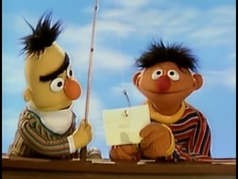

# Exercises


### :book: Reading aloud



> "Read more to write better."  

Let's practice reading R scripts to a partner, who will listen to what you say and try to turn it back into code. It's like a game of *telephone*, but for R.

#### Steps

_Find a partner and decide who gets to be **Bert** and who gets to be **Ernie**._

1. Bert will look at the first code block and tell Ernie what it does.
1. Ernie will then write a code snippet that accomplishes what Bert said.
1. Then Bert can offer more clues to help.
    - Try **not** to say the exact syntax or names of functions, like "use `filter`" or "use `write csv`"

<br>
<details>
<summary><b>Example</b> <i>(Click here)</i></summary>
  
Say aloud what this code does or tries to accomplish.  

```r
library(sandwich)
    
slices_bread <- 4

fillings <- read_csv("fillings.csv")

nrow(fillings)

names(fillings)

red_veggies <- filter(fillings, food_type == "vegetable", color = "red")

```    

</details>    

<br>

> :warning: Wait to click below until you have assigned roles. 

<br>

### Bert reads: `big fish` :fish:

We'll start by turning some fishy code into plain language.

<details>

<summary> Bert's :eyes: only!  <i> (No peeking Ernie)</i> </summary>
    
```r

library(readr)

fishes <- read_csv("lake_superior_fish.csv")

names(big_fishes)

nrow(fishes)
 
big_fishes <- filter(fishes, length > 20)

nrow(big_fishes)

```

<details>

**<summary> Example reading  </summary>**
  
> *Load the package "readr".*  
> *Then read in the Lake Superior fish data stored in a .csv file and name the data "fishes".   
> View the column names in the fishes data.  
> Count the number of fish.*  
>   
> *Create a new table called "big_fishes" that contains only the fish with a length longer than 20 (inches?).  
> Finally, count the number of big fish.*  

</details></details>

<br>

Now let's go the other direction. We'll try to turn _plain language_ into R code.

### Ernie's turn: `sheep count` :sheep::sheep::sheep:

<details>

<summary> Ernie's :eyes: only </summary>
    

```r

library(ggplot2)

asleep <- FALSE

names <- c("Shaun", "Lambchop", "Dolly")

sheep_ids <- 1:3

my_sheep <- data.frame(sheep_name = names, 
                       sheep_id   = sheep_ids)

counting <- ggplot(my_sheep, aes(x = names, y = sheep_id)) +
            geom_point()

counting + labs(title = "Counting sheep backwards makes me Zzzz...")

asleep <- TRUE
 
```   
  
<details>

**<summary> Example reading  </summary>**
  
>     
> *Load the package "ggplot2".*  
> *Create a new variable named "asleep" and set it to false.     
> Create a vector called "names" that contains the 3 text values: "Shaun", "Lambchop" & "Dolly"    
> Create a new variable named "sheep_id" and assign it three values: 1, 2, & 3    
> Create a data frame called "my_sheep" with 2 columns:*  
>    - *"sheep_name" that contains the sheep `names` above*  
>    - *"sheep_id" that contains the `sheep_ids` above*    
>  
> *Make a point plot of my_sheep, with the sheep names along the x-axis and sheep IDs on the y-axis.    
> Add a plot title, "Counting sheep backwards makes me Zzzz...".  
> Set the variable `asleep` to true.*  

</details>
</details>
