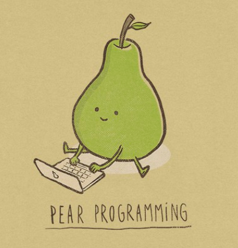
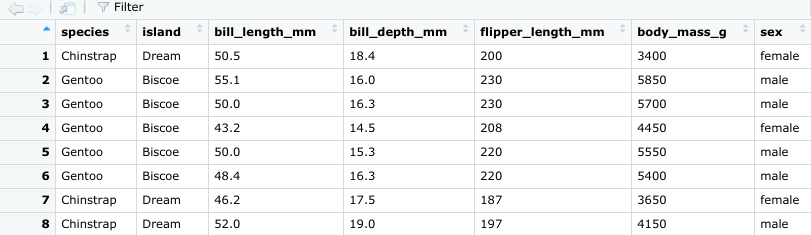
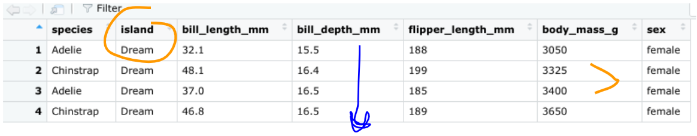
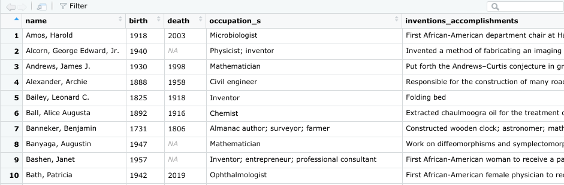
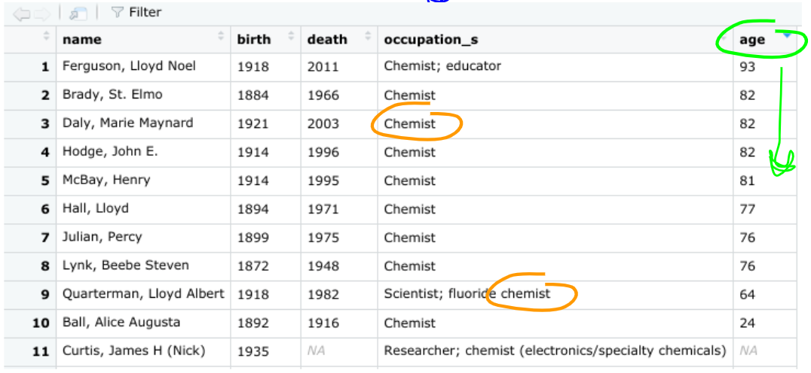
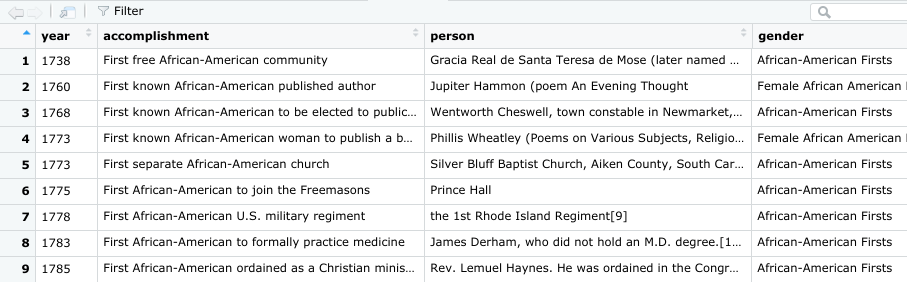
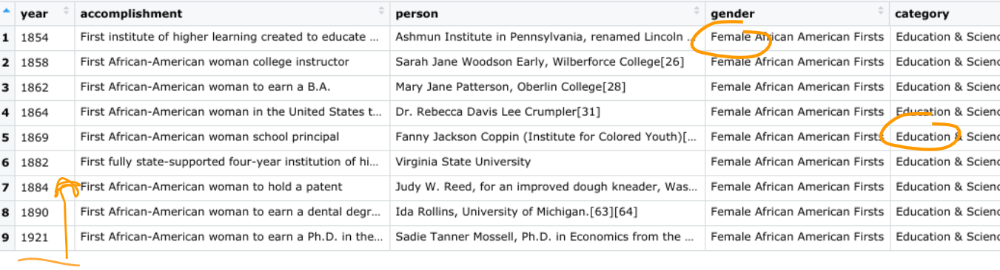
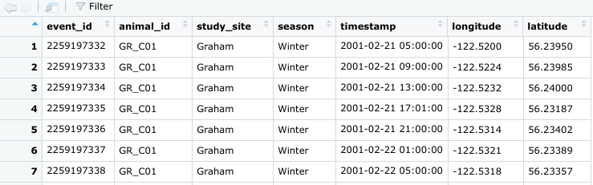
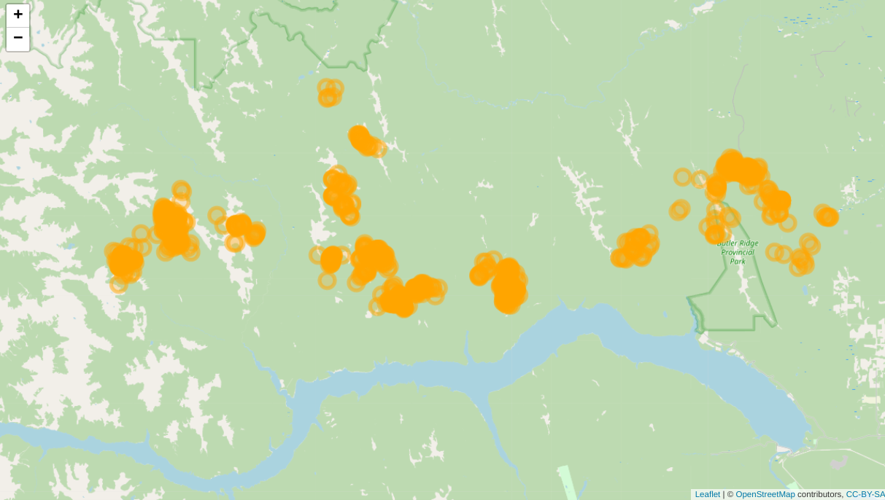

# Pair programming



<br>

> "Two pears are better than one."  

<br>

Let's practice writing R scripts as a team. One partner will convey what you want to accomplish, while the other writes the R script. There's no pressure, but there may be sugaR :candy: points on the line.

<br>

**Come back and join the big group at ` 9:55 `**

<br>

### Instructions

_Use Teams to screen-share with your partner. Then the one who already has R open should share their screen. They will be the first script writer. The other person will be the visionary coach for the first challenge._

1. The script writer will start reading in the data using the given code.
1. The coach will look at the desired end goal and think about possible first steps.
1. The coach conveys the goal and steps to their partner as they start building their script.
1. Keep working together to reach the end result shown in the **Goal** section.

> **Ta-da!** After completing the first one, switch roles and move on to the next challenge.

<br>

#### :warning: Hold up! Wait until the script writer is sharing their screen to read the challenge. 

<br>

# Code challenge #1: Penguins Dream of Palm Trees

<b>Read data</b> <i>(For the script writer)</i>
  
We'll be working with Antarctic penguin data.

```r
remotes::install_github("allisonhorst/palmerpenguins")

library(palmerpenguins)

pengs <- penguins 

# Now what? Ask the coach, they will guide you.
```      

<br>

<details>
<summary> <b>Coach's :eyes: only! </b> <i> (Click to see the goal) </i> </summary>

<br>

**Starting data**



<br><br>

**End Goal**

> Filter the `island`, `bill_length` and `body_mass` to find only these **4** Dreamy penguins.

> 

  
</details> 
<br>


# Code challenge #2: The First of Many

<b>Read data</b> <i>(For the script writer)</i>
  
We'll be working with the African American achievement data at [Tidy Tuesday](https://github.com/rfordatascience/tidytuesday/blob/master/data/2020/2020-06-23/readme.md).

```r
library(readr)

# Get the Data
#firsts <- read_csv('https://raw.githubusercontent.com/rfordatascience/tidytuesday/master/data/2020/2020-06-09/firsts.csv')
science <- read_csv('https://raw.githubusercontent.com/rfordatascience/tidytuesday/master/data/2020/2020-06-09/science.csv')

View(science)

# Now what? Ask the coach, they will guide you.
```      

<br>

_Hint:_ _Try [`str_detect()`](https://stringr.tidyverse.org/reference/str_detect.html) from tidyverse or `grepl()` to detect whether some "text" occurs anywhere in a column._

<br>

<details>
<summary> <b>Coach's :eyes: only! </b> <i> (Click to see the goal) </i> </summary>

<br>

**Starting data**



<br><br>

**End Goal**

> There are 14 "chemists" in the data, to what `age` did they live to? Who is missing age information?

> 

  
</details> 
<br>


# Code challenge #3: Education Firsts

<b>Read data</b> <i>(For the script writer)</i>
  
We'll be working with the African American achievement data at [Tidy Tuesday](https://github.com/rfordatascience/tidytuesday/blob/master/data/2020/2020-06-23/readme.md).

```r
library(readr)

# Get the Data
firsts <- read_csv('https://raw.githubusercontent.com/rfordatascience/tidytuesday/master/data/2020/2020-06-09/firsts.csv')
#science <- read_csv('https://raw.githubusercontent.com/rfordatascience/tidytuesday/master/data/2020/2020-06-09/science.csv')

View(firsts)

# Now what? Ask the coach, they will guide you.
```      
     

<br>

<details>
<summary> <b>Coach's :eyes: only! </b> <i> (Click to see the goal) </i> </summary>

<br>

**Starting data**



<br> <br>

**End Goal**

> **Pre-1930 female firsts in Education**

> 

  
</details> 
<br>


# Code challenge #4: Caribou Tracks

<b>Read data</b> <i>(For the script writer)</i>
  
We'll be working with the caribou traking data at [Tidy Tuesday Caribou](https://github.com/rfordatascience/tidytuesday/blob/master/data/2020/2020-06-23/readme.md).


```r
library(readr)
library(leaflet)
## Leaflet circle markers: https://rstudio.github.io/leaflet/markers.html

# Get the Data
#meet_the_caribou <- read_csv('https://raw.githubusercontent.com/rfordatascience/tidytuesday/master/data/2020/2020-06-23/individuals.csv')

tracks <- read_csv('https://raw.githubusercontent.com/rfordatascience/tidytuesday/master/data/2020/2020-06-23/locations.csv')

# Now what? Ask the coach, they will guide you.
```      

<br>

<details>
<summary> <b>Coach's :eyes: only! </b> <i> (Click to see the goal) </i> </summary>

<br>

**Starting data**



<br><br>

**End Goal**

> **Map of locations for Caribou ID:`"GR_C15"`**

> 

  
</details> 
<br>

