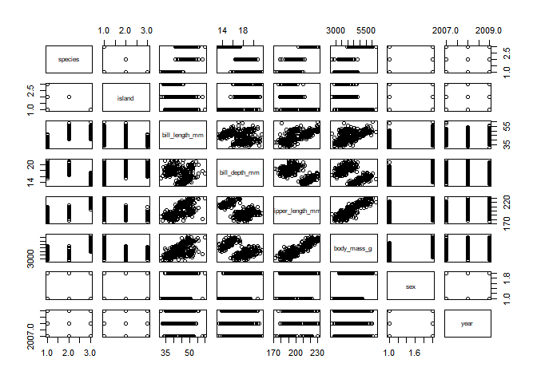
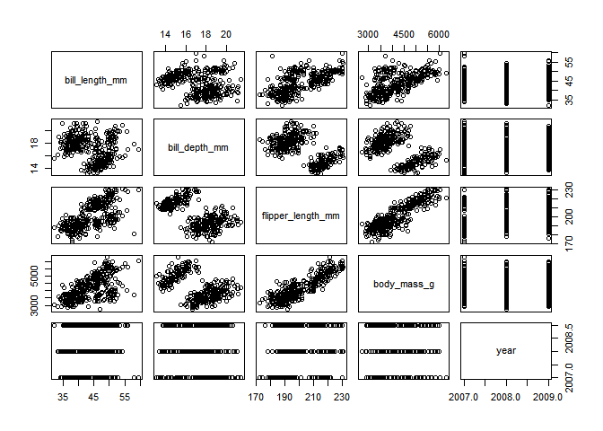
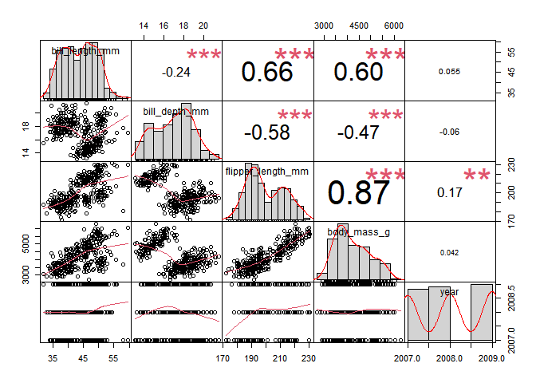
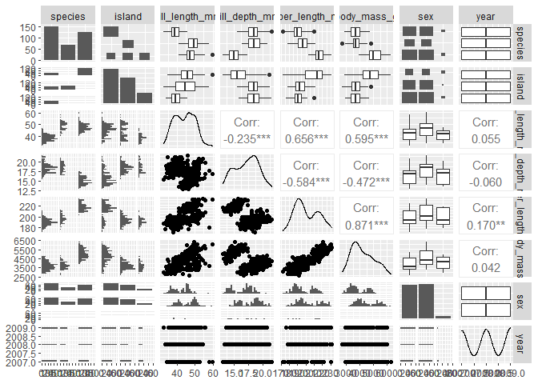
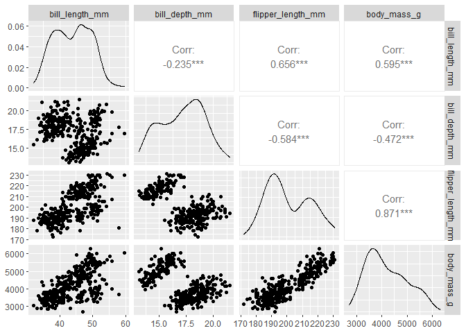
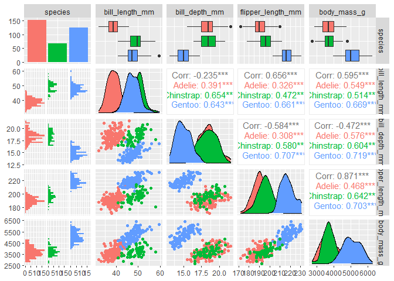
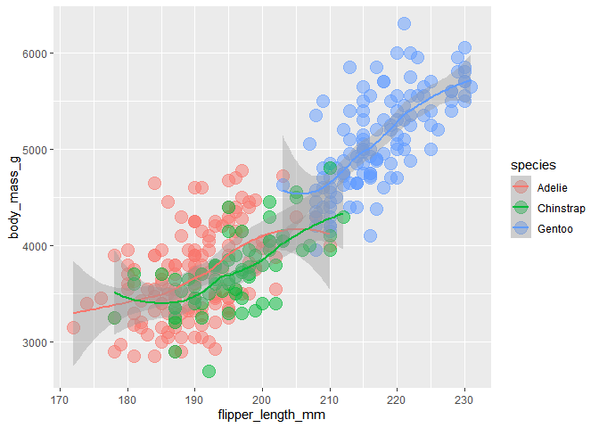
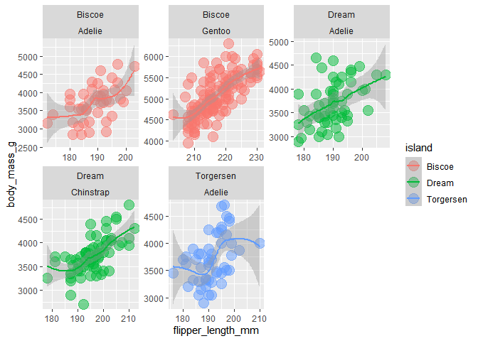
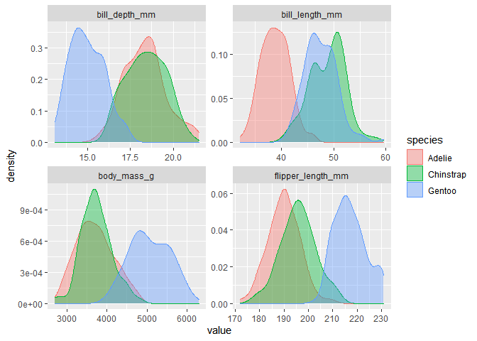

Tidy data relationships
================

Bring in the penguins

``` r
library(tidyverse)
library(palmerpenguins)

penguins <- penguins

names(penguins)
```

    ## [1] "species"           "island"            "bill_length_mm"   
    ## [4] "bill_depth_mm"     "flipper_length_mm" "body_mass_g"      
    ## [7] "sex"               "year"

# pairs() - Compare everything!

``` r
pairs(penguins)
```

<!-- -->

### Only the numeric columns
``` r
pairs(penguins %>% select(where(is.numeric)))
```

<!-- -->

# PerformanceAnalytics

``` r
library(PerformanceAnalytics)

chart.Correlation(penguins %>% select(where(is.numeric)), histogram = T)
```

<!-- -->

# GGally

``` r
library(GGally)

ggpairs(penguins)
```

    ## Warning: Removed 2 rows containing non-finite values (stat_boxplot).

> Lots of warnings. It is okay. 


<!-- -->

``` r
ggpairs(penguins[,3:6])
```

  
<!-- -->

``` r
ggpairs(penguins[ ,c(1,3:6)],
        mapping = aes(color = species))
```


<!-- -->


<br>

## Digging in with ggplot

``` r
ggplot(penguins, aes(x = flipper_length_mm, y = body_mass_g)) +
  geom_point(aes(color = species), 
             size = 5, 
             alpha = 0.5) +
  geom_smooth(aes(color = species))
```

    ## `geom_smooth()` using method = 'loess' and formula 'y ~ x'

    ## Warning: Removed 2 rows containing non-finite values (stat_smooth).

    ## Warning: Removed 2 rows containing missing values (geom_point).

<!-- -->

<br>

## Use `facet_wrap` to split into multiple charts by category
``` r
# Facet
ggplot(penguins, aes(x = flipper_length_mm, y = body_mass_g)) +
  geom_point(aes(color = island), 
             size = 5, 
             alpha = 0.5) +
  geom_smooth(aes(color = island)) +
  facet_wrap(island~species, scales = "free")
```


<!-- -->


<br>

## Compare species differences for all measurments

<br>

- **Step1:** Gather all the metrics with `pivot_longer()`

<br>

### Find the numeric columns
``` r
names(penguins) %>% cat()
```

    ## species island bill_length_mm bill_depth_mm flipper_length_mm body_mass_g sex year

### Collapse them with `pivot_longer()`
``` r
numeric_gathered <- penguins %>%
          pivot_longer(c(contains("mm"), body_mass_g),
                       names_to = "metric", 
                       values_to = "value")

```


### `facet_wrap()` with our new "metric" column
```r
ggplot(numeric_gathered, aes(x = value, color = species, fill = species)) +
  geom_density(alpha = 0.4) +
  facet_wrap(~ metric, scales = "free")
```


<!-- -->

## Next time...

 - left_join() coordinates for islands / monitor sites
- Linear models
